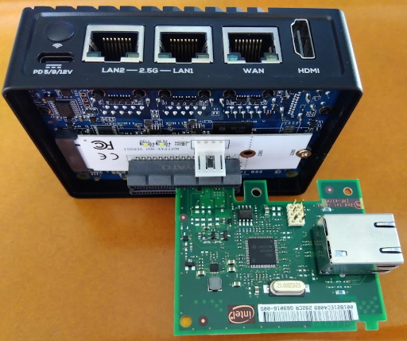

# nanopi R5S をセットアップするためのメモ書き

## 概要

nanopi R5S をubuntu箱として使うための，セットアップ方法及び，知っておくべき点等のメモ．ラズパイは使ったことがあるが，nanopi R5Sはよくわからん，という人向け．(自分用)

nanopiには複数の種類があり，それぞれ全く別物になっている．ここでは，R5Sのみを対象としている．また，openWRT用のセットアップ等もあるが，ここではubuntuとして使うためのセットアップの説明を行う．

ちなみに，セットアップ後にディストリビューションのバージョンを確認するとこうなる．

```shell
$ cat /etc/lsb-release
DISTRIB_ID=Ubuntu
DISTRIB_RELEASE=20.04
DISTRIB_CODENAME=focal
DISTRIB_DESCRIPTION="Ubuntu 20.04.5 LTS"
```

nanopi R5Sに関する情報は以下のwikiに書かれている．

https://wiki.friendlyelec.com/wiki/index.php/NanoPi_R5S

ベンチマーク等については下記のサイトが詳しい．

https://www.cnx-software.com/2022/06/05/nanopi-r5s-preview-part-2-ubuntu-20-04-friendlycore/

＊注＊

ネットワークのテスト用にnanopiを使うことが多いため，そういう用途を前提としたセットアップになっている．いわゆるデスクトップPC的な使い方は想定していないので注意．GUIも使わない設定にする．特にネットワーク周りの自動的な設定は極力排除する方針．


## SDカードのパーティションについて

32GのSDカードを使って初期イメージを書き込んだ状態で，以下のようにパーティションが設定される．

```shell
$ sudo parted /dev/mmcblk0 print
Model: SD DR032 (sd/mmc)
Disk /dev/mmcblk0: 30.9GB
Sector size (logical/physical): 512B/512B
Partition Table: gpt
Disk Flags:

Number  Start   End     Size    File system  Name      Flags
 1      8389kB  12.6MB  4194kB               uboot
 2      12.6MB  16.8MB  4194kB               misc
 3      16.8MB  21.0MB  4194kB               dtbo
 4      21.0MB  37.7MB  16.8MB               resource
 5      37.7MB  79.7MB  41.9MB               kernel
 6      79.7MB  113MB   33.6MB               boot
 7      113MB   147MB   33.6MB               recovery
 8      147MB   2533MB  2387MB  ext4         rootfs
 9      2533MB  30.9GB  28.4GB  ext4         userdata

```

ラズパイの場合は，大抵はbootとlinux(rootfs)の2つしかなかったが，nanopiの場合かなり細かく分けられている．また，パーティション8,9はファイルシステムになっているが，それ以外はバイナリが直接置かれている状態でファイルシステムとしてはアクセスできない．

起動後に見えるファイルシステムは，userdataがrootfsの上にoverlayとして乗せられた状態になる．
このため，userdataの中を全て消去すれば，SDカード作成直後の状態に簡単に戻るし，userdata部分だけバックアップしておけば，環境の再現も出来る．

## 一番最初にやるべき事はSDイメージの再構築

nanopi R5S は，apt-getでカーネルヘッダを入れることも出来ず，そのままではドライバのビルドの際に困ることになる．また，カーネルのconfigを確認するときにも困る．
本家のwikiには，/optにヘッダが入っている旨が書かれているが，実際にイメージをダウンロードしてSDに書いてみると入っていない．

このため，カーネルのビルドを含め，SDカードのイメージを一度手元で構築しておくと後々楽になる．

イメージ構築用のスクリプトがあるので，それを使ってSDカードを作成する．その際，クロスコンパイル環境が必要で，x86マシン(64bit linux)が必須．
恐らく，ビルド用スクリプトに多少手を入れる程度でセルフコンパイル用に修正できると思われるが，ビルド時間は非常に長いため，あまり現実的ではない．CPUパワーがある環境で実行すべき．core i5で数十分かかる．

### ビルド環境を整える

最低限，カーネルのビルドができるだけのツールがx86マシンに入っていることが必要．apt-getで入れる．

```shell
$ sudo apt-get install -y build-essential bc bison flex libelf-dev libssl-dev libncurses5-dev android-sdk-libsparse-utils
```

### ビルドスクリプトの入手

スクリプトは下記リポジトリに存在する．

https://github.com/friendlyarm/sd-fuse_rk3568

ビルド方法も上記リポジトリに書かれているがあまり親切ではない．
まずは，スクリプト本体と，ファイルシステムのイメージをダウンロードする．
ちなみに，ここでビルドするターゲットは ubuntu なので，friendlycore-focal-arm64 を選択する．

```
$ git clone https://github.com/friendlyarm/sd-fuse_rk3568
$ cd sd-fuse_rk3568
$ wget http://112.124.9.243/dvdfiles/RK3568/images-for-eflasher/friendlycore-focal-arm64-images.tgz
$ tar zxvf friendlycore-focal-arm64-images.tgz
```

### クロスコンパイラの入手

ビルドスクリプトを実行すると，クロスコンパイラを入れろ，と出てくるので，入れる．一応手順が表示されるが，その内容は以下の通り．この作業は，クロスコンパイラをダウンロードして展開するだけのもので，どのディレクトリで行っても構わない．ちなみにインストール先は /opt/FriendlyARM になる．

```
$ git clone https://github.com/friendlyarm/prebuilts.git -b master --depth 1
$ cd prebuilts/gcc-x64
$ cat toolchain-6.4-aarch64.tar.gz* | sudo tar xz -C /
```

### スクリプトの実行

カレントディレクトリをsd-fuse_rk3568に移した状態で
```
$ sudo ./build-kernel.sh friendlycore-focal-arm64
```

これで，必要なファイルのダウンロードとビルドが実行される．
configを書き変えたいような場合であっても，まずは一度スクリプトを最後まで動かすことで，必要なファイル一式を揃えさせる．

### カーネルのconfigとデバイスツリーを書き変えるには

次の2つのファイルを使ってカーネルが構築されるので，configやデバイスツリーを書き変えたい場合には以下のファイルを編集する．

* sd-fuse_rk3568/out/kernel-rk3568/arch/arm64/configs/nanopi5_linux_defconfig
* sd-fuse_rk3568/out/kernel-rk3568/arch/arm64/boot/dts/rockchip/rk3568-nanopi5-rev01.dts

kernelのmenuconfigを使いたい場合は，
```
$ cd sd-fuse_rk3568/out/kernel-rk3568
$ make ARCH=arm64 menuconfig
```

として，.config を作成し，そのファイルで上記のnanopi5_linux_defconfigを上書きする．

書き変えた後は，前回同様にスクリプトを実行する．
```
$ sudo ./build-kernel.sh friendlycore-focal-arm64
```

### rootfsイメージの再構築

必要が無ければ再構築作業は不要．もし，rootfsの中を編集したい場合には，sd-fuse_rk3568/out/rootfs_new の中を編集する．その際，パーミションやUID/GID等に注意すること．基本的にroot権限で編集する必要あり．

編集を終えたら，rootfsのイメージを再構築する．

```shell
sudo ./build-rootfs-img.sh out/rootfs_new friendlycore-focal-arm64
```


### SDカードのイメージを作成

```
$ ./mk-sd-image.sh friendlycore-focal-arm64
```

これで img ファイルが生成されるので，SDリーダ・ライタを接続してddコマンドでSDカードへ書き込む．
SDカードへイメージを書き込むと，SDカードのパーティション8,9がファイルシステムになっているので，必要に応じてマウントしてファイルを書き変える．例えばIPアドレスの設定をこの段階で行ってしまえば，ブート直後からsshで外部からアクセスできる状態になるので便利．

## ブートと更新

作成したSDカードをnanopi R5Sに挿入し，電源を入れる．
friendlycore-focal-arm64の場合，デフォルトのログイン ID/PWは pi/pi になっているので，それでログインする．ログイン後，まずは，アップデートを行う．

```shell
$ sudo apt-get update
$ sudo apt-get upgrade
```

エディタ等，必要なツールを入れる．ここはそれぞれ好みで．

```shell
$ sudo apt-get install nano
```

＊ 自分の作業にとって特に重要なツールは apt-get で入れるのは避けた方が良い ＊

バージョンが古かったり，予期せぬ設定があったりして，ロクなことがない．自前でビルドした方が良い．

## タイムゾーンの設定

```shell
$ sudo dpkg-reconfigure tzdata
```

## localeの設定

必要に応じて．

```shell
$ sudo dpkg-reconfigure locales
```

## 本体裏のLANのLEDが点灯するようにする

デフォルトの状態では，本体裏側のLEDは赤いSYSがチカチカしているだけで，LANケーブルを挿しても光らない．光るように設定する．以下の内容を /etc/rc.local へ追加する．(exit 0の前へ)

```shell
modprobe ledtrig-netdev

echo netdev > /sys/class/leds/wan_led/trigger
echo eth0 > /sys/class/leds/wan_led/device_name
echo 1 > /sys/class/leds/wan_led/link
echo 1 > /sys/class/leds/wan_led/tx

echo netdev > /sys/class/leds/lan1_led/trigger
echo eth1 > /sys/class/leds/lan1_led/device_name
echo 1 > /sys/class/leds/lan1_led/link
echo 1 > /sys/class/leds/lan1_led/tx

echo netdev > /sys/class/leds/lan2_led/trigger
echo eth2 > /sys/class/leds/lan2_led/device_name
echo 1 > /sys/class/leds/lan2_led/link
echo 1 > /sys/class/leds/lan2_led/tx
```

## WANコネクタ(RJ45)のLEDの光り方を変える

LEDは緑と黄色があるが，Link/Actで緑点滅，GbEリンクで黄色点灯，とすることにする．

設定はPHYであるRTL8211F-CGのレジスタを変更することで行う．詳しくはデータシートを参照のこと．緑がLED2, 黄色がLED1であり，PHYのLED0は使われていない模様．
レジスタの操作にはmdio-toolを用いる．自前でビルドの必要あり．

LED control register(Ext:0xd04, Addr:0x10)のビットの割り当てはデータシートによれば以下の通り．

|Bit|Name|Desc|
|---|----|----|
| 15|予約|  - |
| 14|LED2_ACT|LED2 送受信|
| 13|LED2_LINK_1000|LED2 1Gリンク|
| 12|予約|  - |
| 11|LED2_LINK_100|LED2 100Mリンク|
| 10|LED2_LINK_10|LED2 10Mリンク|
| 9|LED1_ACT|LED1 送受信|
| 8|LED1_LINK_1000|LED1 1Gリンク|
| 7|予約|  - |
| 6|LED1_LINK_100|LED1 100Mリンク|
| 5|LED1_LINK_10|LED1 10Mリンク|
| 4|LED0_ACT|LED0 送受信|
| 3|LED0_LINK_1000|LED0 1Gリンク|
| 2|予約|  - |
| 1|LED0_LINK_100|LED0 100Mリンク|
| 0|LED0_LINK_10|LED0 10Mリンク|


```
$ git clone https://github.com/PieVo/mdio-tool.git
$ cd mdio-tool
$ cmake .
$ make
$ sudo make install
```

以下のようにする．(rootで実行の必要あり)

```
/usr/local/bin/mdio-tool w eth0 0x1f 0xd04
/usr/local/bin/mdio-tool w eth0 0x11 0x0
/usr/local/bin/mdio-tool w eth0 0x10 0x6d00
/usr/local/bin/mdio-tool w eth0 0x1f 0x00
```

処理としては，

1. 拡張ページ 0xd04 を選択する
2. EEE LED Control レジスタ 0x11 を0にする
3. LED Control レジスタ 0x10 に 0x6d00 を書く
4. ページを元に戻す

となっている．

上記コマンドをrc.localに追記して，起動時に自動的に設定されるようにする．


## 固定IPにする

/etc/network/interfaces.d にある，インターフェース名と同名のファイルを編集する．例えば eth0 を 192.168.0.123, デフォルトGWを192.168.0.1 にするのであれば，eth0というファイルを以下の内容にする．

```text
auto eth0
iface eth0 inet static
        address 192.168.0.123
        netmask 255.255.255.0
        broadcast 192.168.0.255
        gateway 192.168.0.1
```

/etc/resolv.conf を編集する．このファイルはシンボリックリンクになっているので，まずは削除してしまい，通常のファイルで置き換える．(mDNSを使いたくないので．)

```shell
$ sudo rm /etc/resolv.conf
$ sudo nano /etc/resolv.conf
```

resolv.conf に，nameserverを書く．例えば 192.168.0.1 がDNSサーバになっているなら
```text
nameserver 192.168.0.1
```

## CUIモードにする

GUIは要らないので，グラフィカルな画面が立ち上がらないようにする．

```shell
$ sudo systemctl set-default multi-user.target
```


## 余計なサービスを止める

何が動いているかは次のコマンドで確認
```shell
$ systemctl -l
```

enableかdisableかの一覧を出すには
```shell
$ systemctl list-unit-files
```

何をもって余計とするかは用途次第だが，ここでは，
* 勝手にネットワークの設定をされると困る
* 通信は必要最低限にして欲しい(明示的に指示した通信以外するな)
* マルチキャストは使わないで欲しい

という方針で，要らないやつを止める．どんなunitが存在するかはインストールしたパッケージ次第なので，環境によっては下記のunitが無い場合もある．そこは自分の環境にインストールされているunitを確認して実行すること．
```shell
$ sudo systemctl disable apt-daily-upgrade.timer
$ sudo systemctl disable apt-daily.timer
$ sudo systemctl disable motd-news.timer
$ sudo systemctl disable systemd-resolved.service
$ sudo systemctl disable lcd2usb.service
$ sudo systemctl disable avahi-daemon
$ sudo systemctl disable wpa_supplicant
$ sudo systemctl disable ModemManager
$ sudo systemctl disable NetworkManager
$ sudo systemctl disable networkd-dispatcher.service
```

パケットキャプチャを行う予定があるなら，NetworkManagerは絶対に止めて置くべき．トラブルの元凶．

### timesyncdを止める

chrony等，時刻同期のツールを入れる場合にはこれを止めておかないとトラブる．もちろん，時刻同期のツールを入れないのであれば残しておく．

```shell
$ sudo systemctl stop systemd-timesyncd.service
$ sudo systemctl disable systemd-timesyncd.service
```


## Networkのバッファサイズの設定

大きめのウインドウを指定したい場合等があるので，大きめのメモリを割り当てて置く．

```shell
$ sudo cp /etc/sysctl.conf /etc/sysctl.conf.bak
$ sudo sh -c "cat >> /etc/sysctl.conf" << EOF
net.core.rmem_max = 33554432
net.core.wmem_max = 33554432
net.core.rmem_default = 16777216
net.ipv4.tcp_rmem = 4096 87380 33554432
net.ipv4.tcp_wmem = 4096 65536 33554432
net.ipv4.udp_mem = 65536 131072 262144
net.ipv4.udp_rmem_min = 16384
net.ipv4.udp_wmem_min = 16384
EOF
```

## GPIOを使うには

ピン配置についてWikiを参照．https://wiki.friendlyelec.com/wiki/index.php/NanoPi_R5S

コネクタがFPCになっており，GPIOを使うためにはケーブルとピッチ変換基板を購入する必要あり．

12ピン，0.5mmピッチ，という物が必要．amazonなら，
* ケーブル：https://www.amazon.co.jp/dp/B09V2K1S2C
* 基板：https://www.amazon.co.jp/dp/B07H2CN4TZ/

### 現状の設定確認

以下は，1PPS用の設定が追加されているので，デフォルトとは多少違っているので注意．

```shell
$ sudo cat /sys/kernel/debug/gpio
gpiochip0: GPIOs 0-31, parent: platform/fdd60000.gpio0, gpio0:
 gpio-0   (                    |reset               ) out hi
 gpio-6   (                    |vcc5v0-host-regulato) out hi
 gpio-14  (                    |reset               ) out hi
 gpio-21  (                    |snps,reset          ) out hi ACTIVE LOW
 gpio-28  (                    |gpio-regulator      ) out lo

gpiochip1: GPIOs 32-63, parent: platform/fe740000.gpio1, gpio1:

gpiochip2: GPIOs 64-95, parent: platform/fe750000.gpio2, gpio2:
 gpio-81  (                    |wan_led             ) out lo

gpiochip3: GPIOs 96-127, parent: platform/fe760000.gpio3, gpio3:
 gpio-117 (                    |pps@3               ) in  lo
 gpio-126 (                    |lan1_led            ) out lo
 gpio-127 (                    |lan2_led            ) out lo

gpiochip4: GPIOs 128-159, parent: platform/fe770000.gpio4, gpio4:
 gpio-128 (                    |K1                  ) in  hi ACTIVE LOW
 gpio-154 (                    |sys_led             ) out lo

gpiochip5: GPIOs 511-511, parent: platform/rk805-pinctrl, rk817-gpio, can sleep:

```

### GPIO番号の算出

nanopi R5S の wikiだけでは計算方法がわからないので，同じチップを使っている以下のページを参照．

https://wiki.t-firefly.com/en/ROC-RK3568-PC/driver_gpio.html

上記ページからの引用：
```text
bank = 4;      //GPIO4_D5 => 4, bank ∈ [0,4]
group = 3;      //GPIO4_D5 => 3, group ∈ {(A=0), (B=1), (C=2), (D=3)}
X = 5;       //GPIO4_D5 => 5, X ∈ [0,7]
number = group * 8 + X = 3 * 8 + 5 = 29
pin = bank*32 + number= 4 * 32 + 29 = 157;
```

例えば，GPIO3_C2 を操作したいのであれば，pinは
```text
3 * 32 + 2 * 8 + 2 = 114
```
となる．

### GPIOを操作してみる

```shell
$ sudo su
# cd /sys/class/gpio
# echo 114 > export
# ls
export  gpio114  gpiochip0  gpiochip128  gpiochip32  gpiochip511  gpiochip64  gpiochip96  unexport
# cd gpio114
# ls
active_low  device  direction  edge  power  subsystem  uevent  value
# echo out > direction
# echo 1 > value
```

とすれば，GPIO3_C2 (pin5)が1になる。

## M.2コネクタにSSDを取り付ける

使えるのは，M.2 type 2280 というサイズのNVMe SSD．
SSDを搭載すると，/dev/nvme0n1 として見える．
fdiskでパーティションを作成し，mkfsでファイルシステムを作成してマウントする．

## M.2コネクタでPCIeのカードは動くか？

i210のLANカードを試した所問題は無さそう．



```text
$ sudo lspci -t -v
-+-[0002:20]---00.0-[21]----00.0  Intel Corporation I210 Gigabit Network Connection
 +-[0001:10]---00.0-[11]----00.0  Realtek Semiconductor Co., Ltd. RTL8125 2.5GbE Controller
 \-[0000:00]---00.0-[01-ff]----00.0  Realtek Semiconductor Co., Ltd. RTL8125 2.5GbE Controller
```

```
$ sudo lspci -s 0002:21:00.0 -vv
0002:21:00.0 Ethernet controller: Intel Corporation I210 Gigabit Network Connection (rev 03)
        Subsystem: Intel Corporation Ethernet Server Adapter I210-T1
        Control: I/O- Mem- BusMaster- SpecCycle- MemWINV- VGASnoop- ParErr- Stepping- SERR- FastB2B- DisINTx-
        Status: Cap+ 66MHz- UDF- FastB2B- ParErr- DEVSEL=fast >TAbort- <TAbort- <MAbort- >SERR- <PERR- INTx-
        Interrupt: pin A routed to IRQ 0
        Region 0: Memory at f0200000 (32-bit, non-prefetchable) [disabled] [size=1M]
        Region 3: Memory at f0400000 (32-bit, non-prefetchable) [disabled] [size=16K]
        Expansion ROM at f0300000 [virtual] [disabled] [size=1M]
        Capabilities: [40] Power Management version 3
                Flags: PMEClk- DSI+ D1- D2- AuxCurrent=0mA PME(D0+,D1-,D2-,D3hot+,D3cold+)
                Status: D0 NoSoftRst+ PME-Enable- DSel=0 DScale=1 PME-
        Capabilities: [50] MSI: Enable- Count=1/1 Maskable+ 64bit+
                Address: 0000000000000000  Data: 0000
                Masking: 00000000  Pending: 00000000
        Capabilities: [70] MSI-X: Enable- Count=5 Masked-
                Vector table: BAR=3 offset=00000000
                PBA: BAR=3 offset=00002000
        Capabilities: [a0] Express (v2) Endpoint, MSI 00
                DevCap: MaxPayload 512 bytes, PhantFunc 0, Latency L0s <512ns, L1 <64us
                        ExtTag- AttnBtn- AttnInd- PwrInd- RBE+ FLReset+ SlotPowerLimit 0.000W
                DevCtl: CorrErr- NonFatalErr- FatalErr- UnsupReq-
                        RlxdOrd+ ExtTag- PhantFunc- AuxPwr- NoSnoop+ FLReset-
                        MaxPayload 128 bytes, MaxReadReq 512 bytes
                DevSta: CorrErr- NonFatalErr- FatalErr- UnsupReq- AuxPwr+ TransPend-
                LnkCap: Port #4, Speed 2.5GT/s, Width x1, ASPM L0s L1, Exit Latency L0s <2us, L1 <16us
                        ClockPM- Surprise- LLActRep- BwNot- ASPMOptComp+
                LnkCtl: ASPM Disabled; RCB 64 bytes Disabled- CommClk+
                        ExtSynch- ClockPM- AutWidDis- BWInt- AutBWInt-
                LnkSta: Speed 2.5GT/s (ok), Width x1 (ok)
                        TrErr- Train- SlotClk+ DLActive- BWMgmt- ABWMgmt-
                DevCap2: Completion Timeout: Range ABCD, TimeoutDis+, NROPrPrP-, LTR-
                         10BitTagComp-, 10BitTagReq-, OBFF Not Supported, ExtFmt-, EETLPPrefix-
                         EmergencyPowerReduction Not Supported, EmergencyPowerReductionInit-
                         FRS-, TPHComp-, ExtTPHComp-
                         AtomicOpsCap: 32bit- 64bit- 128bitCAS-
                DevCtl2: Completion Timeout: 50us to 50ms, TimeoutDis-, LTR-, OBFF Disabled
                         AtomicOpsCtl: ReqEn-
                LnkCtl2: Target Link Speed: 2.5GT/s, EnterCompliance- SpeedDis-
                         Transmit Margin: Normal Operating Range, EnterModifiedCompliance- ComplianceSOS-
                         Compliance De-emphasis: -6dB
                LnkSta2: Current De-emphasis Level: -6dB, EqualizationComplete-, EqualizationPhase1-
                         EqualizationPhase2-, EqualizationPhase3-, LinkEqualizationRequest-
        Capabilities: [100 v2] Advanced Error Reporting
                UESta:  DLP- SDES- TLP- FCP- CmpltTO- CmpltAbrt- UnxCmplt- RxOF- MalfTLP- ECRC- UnsupReq- ACSViol-
                UEMsk:  DLP- SDES- TLP- FCP- CmpltTO- CmpltAbrt- UnxCmplt- RxOF- MalfTLP- ECRC- UnsupReq- ACSViol-
                UESvrt: DLP+ SDES+ TLP- FCP+ CmpltTO- CmpltAbrt- UnxCmplt- RxOF+ MalfTLP+ ECRC- UnsupReq- ACSViol-
                CESta:  RxErr- BadTLP- BadDLLP- Rollover- Timeout- AdvNonFatalErr-
                CEMsk:  RxErr- BadTLP- BadDLLP- Rollover- Timeout- AdvNonFatalErr+
                AERCap: First Error Pointer: 00, ECRCGenCap+ ECRCGenEn- ECRCChkCap+ ECRCChkEn-
                        MultHdrRecCap- MultHdrRecEn- TLPPfxPres- HdrLogCap-
                HeaderLog: 00000000 00000000 00000000 00000000
        Capabilities: [140 v1] Device Serial Number 00-1b-21-ff-ff-ec-40-89
        Capabilities: [1a0 v1] Transaction Processing Hints
                Device specific mode supported
                Steering table in TPH capability structure

```

## LANで利用可能なタイムスタンプの確認

パケットキャプチャを行う際に，ハードウエアタイムスタンパが利用可能か確認する．

```
$ sudo dumpcap -i eth0 --list-time-stamp-types
Timestamp types of the interface (use option --time-stamp-type to set):
  host (Host)
  adapter_unsynced (Adapter, not synced with system time)
$ sudo dumpcap -i eth1 --list-time-stamp-types
Timestamp types of the interface (use option --time-stamp-type to set):
  host (Host)
$ sudo dumpcap -i eth2 --list-time-stamp-types
Timestamp types of the interface (use option --time-stamp-type to set):
  host (Host)
```

eth0のみが，ハードウエアタイムスタンパに対応している模様．eth1,2は利用不可能．

```
$ ethtool -T eth0
Time stamping parameters for eth0:
Capabilities:
        hardware-transmit     (SOF_TIMESTAMPING_TX_HARDWARE)
        software-transmit     (SOF_TIMESTAMPING_TX_SOFTWARE)
        hardware-receive      (SOF_TIMESTAMPING_RX_HARDWARE)
        software-receive      (SOF_TIMESTAMPING_RX_SOFTWARE)
        software-system-clock (SOF_TIMESTAMPING_SOFTWARE)
        hardware-raw-clock    (SOF_TIMESTAMPING_RAW_HARDWARE)
PTP Hardware Clock: 0
Hardware Transmit Timestamp Modes:
        off                   (HWTSTAMP_TX_OFF)
        on                    (HWTSTAMP_TX_ON)
Hardware Receive Filter Modes:
        none                  (HWTSTAMP_FILTER_NONE)
        all                   (HWTSTAMP_FILTER_ALL)
        ptpv1-l4-event        (HWTSTAMP_FILTER_PTP_V1_L4_EVENT)
        ptpv1-l4-sync         (HWTSTAMP_FILTER_PTP_V1_L4_SYNC)
        ptpv1-l4-delay-req    (HWTSTAMP_FILTER_PTP_V1_L4_DELAY_REQ)
        ptpv2-l4-event        (HWTSTAMP_FILTER_PTP_V2_L4_EVENT)
        ptpv2-l4-sync         (HWTSTAMP_FILTER_PTP_V2_L4_SYNC)
        ptpv2-l4-delay-req    (HWTSTAMP_FILTER_PTP_V2_L4_DELAY_REQ)
        ptpv2-event           (HWTSTAMP_FILTER_PTP_V2_EVENT)
        ptpv2-sync            (HWTSTAMP_FILTER_PTP_V2_SYNC)
        ptpv2-delay-req       (HWTSTAMP_FILTER_PTP_V2_DELAY_REQ)
```

eth1,2も，RTL8125のドライバを，設定を変えて再コンパイルするとPTP機能を有効にできるが汎用タイムスタンパとしては使えない．ついでに言うと，eth1,2はPHCの挙動が不安定で使い物になるかどうか良くわからない．うまく動かすための設定がまだわからない．

